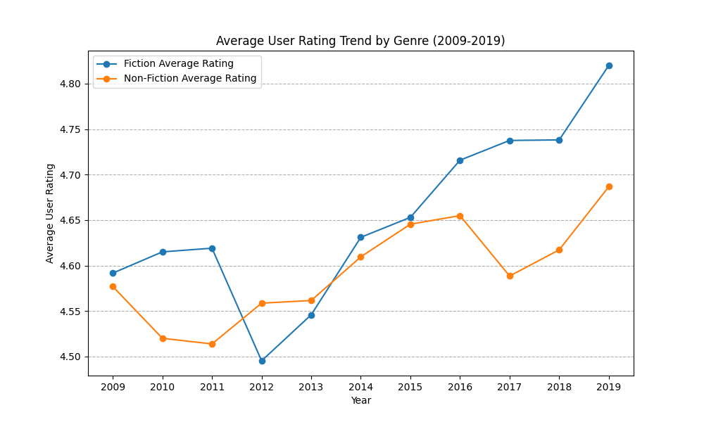
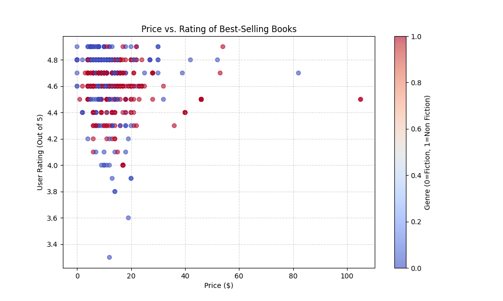
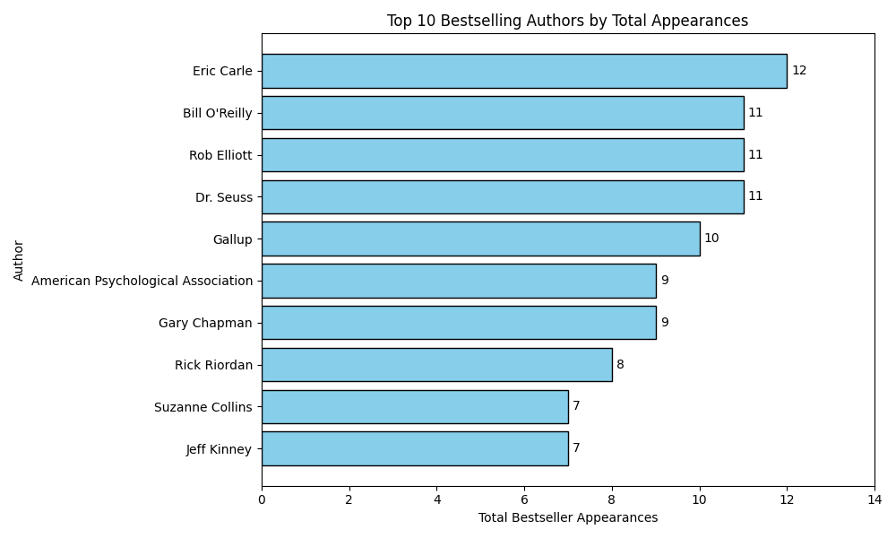
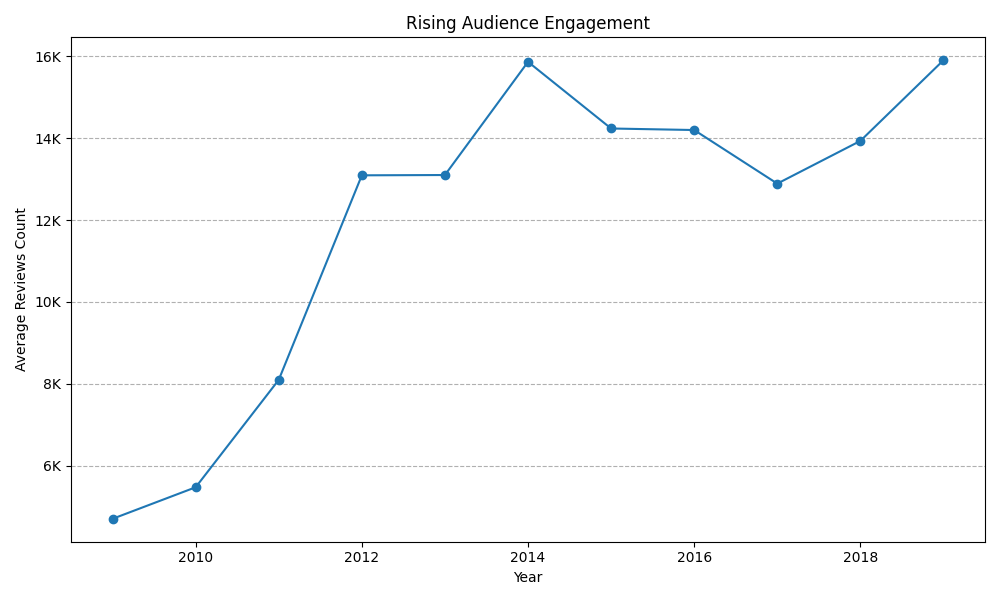

# Amazon Best-Selling Books Analysis (2009-2019)

## 📌 Project Overview

This project is a **data analysis** of Amazon's annual 50 best-selling books from **2009 to 2019**. The primary goal was to uncover hidden trends and statistical relationships within the dataset to determine common characteristics of books that achieve best-seller status.

### Key Questions Explored:

- Does the price of a book influence its best-selling status, or is it reviews/ratings?
- How do ratings and reviews counts correlate across different genres?
- What are the yearly trends in the proportion of Fiction vs Non-Fiction best-sellers?
- Which authors and books have the highest number of repeat appearances?

## 📊 Key Findings & Visualizations

The analysis yielded several actionable insights into the best-seller landscape over the decade.

### 1. Genre Performance

**Non-Fiction** titles consistently held a slight advantage in **average user rating** over Fiction titles throughout the period.

### 2. Price vs. Rating

While higher ratings are expected, there was **no strong positive correlation** between a book's price and its user rating, suggesting consumers prioritize content over cost for top-rated books.

### 3. Top Authors

Author **Suzanne Collins** (Fiction) and **Jeff Kinney** (Non-Fiction) had the highest number of unique best-seller appearances, dominating the lists in the early 2010s.

### 4. Rising audience

The **average number of reviews** for best-selling books has shown a **significant upward trend** since the early 2010s, suggesting a continuous increase in online consumer and platform maturity.

## ⚙️ Technical Stack

- **Language**: Python 3.9+
- **Analysis**: Pandas (for data manipulation and aggregation).
